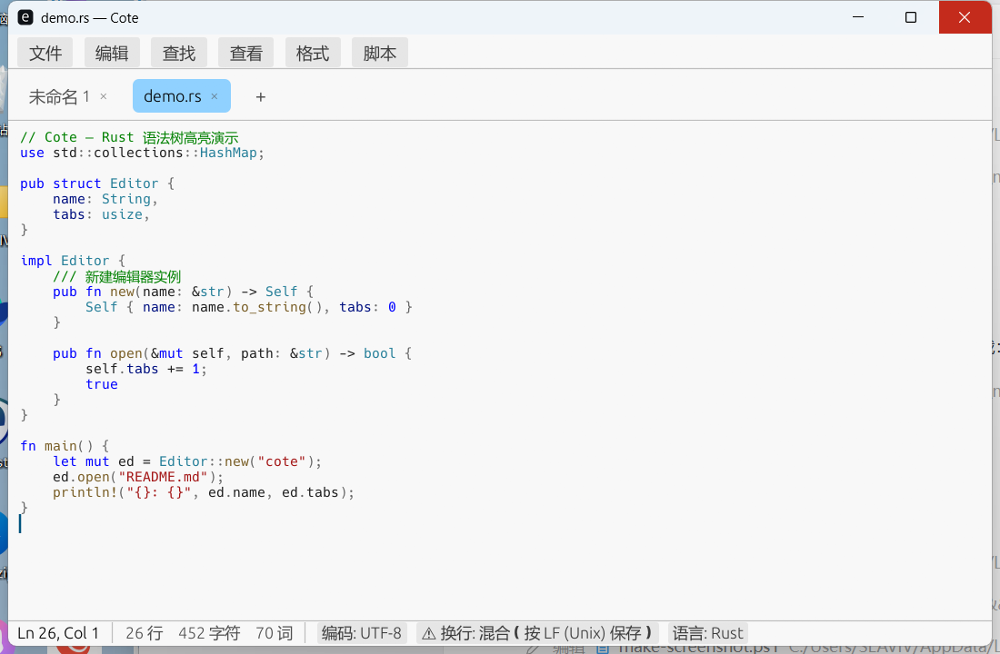

<div align="center">


# Cote

**轻量、快速、开箱即用的跨平台纯文本编辑器** — CotEditor 风格，Rust 实现

[](https://github.com/Buddleek/cote/actions/workflows/ci.yml)
[](#license)
[](https://www.rust-lang.org)

Windows · macOS · Linux ｜ x86_64 · aarch64



</div>

---

Cote 是一款面向纯文本与轻量代码编辑的桌面编辑器：**语法树级高亮、完善的编码/换行符管理、
多标签、大纲导航、JS 脚本自动化**——保持轻快的同时覆盖日常编辑所需。
对标 [CotEditor](https://coteditor.com)（macOS），将这套体验带到所有桌面平台。

## 特性一览

| | |
|---|---|
| 🌈 **语法树级高亮** | tree-sitter 驱动 8 种语言（Rust / Python / JavaScript / C / JSON / Java / C++ / HTML·XML），函数、类型、属性、常量独立着色；另有扫描式分词 10 种（Go / C# / Kotlin / Ruby / Shell / SQL / YAML / TOML / Markdown…），共 18 种内置语言 |
| 🈶 **编码与换行** | BOM → UTF-8 校验 → 统计检测三级自动识别（GBK / Big5 / Shift_JIS / UTF-16 / UTF-32…）；编码一键转换、有损字符预警；LF / CRLF / CR 识别与转换 |
| ↩️ **可靠的撤销** | rope 数据结构 + 分组撤销：连续输入/退格合并为单步，批量变换整组回退，Ctrl+Z 由编辑内核接管 |
| 🗂️ **多标签编辑** | 一体化标签栏、中键关闭、未保存确认、30s 自动保存（原子写入）、会话恢复、外部修改检测 |
| 🔍 **查找替换** | 纯文本与正则（fancy-regex）、大小写/整词、捕获组 `$1`、匹配计数、跳转到行 |
| 📑 **大纲与补全** | 按语言规则提取函数/类/标题，侧栏点击跳转；Ctrl+Space 文档内单词补全 |
| 🧩 **JS 脚本** | `scripts/*.js` 自动进菜单，`cote.text()` / `cote.setText()` / `cote.selection()` 等 API，沙箱隔离（无文件/网络能力，防死循环） |
| 🎨 **可定制语法** | JSON 定义自定义语言（关键词/注释符/大纲正则/标记模式），放入配置目录即生效 |
| ♿ **细节** | Unicode 安全（grapheme 光标、NFC/NFD/NFKC/NFKD）、全角↔半角、CJK 字数统计、深浅色切换（跟随系统 / 手动，Ctrl+Shift+L）、CJK 字体回退、AccessKit 无障碍 |

## 快速开始

```bash
git clone https://github.com/Buddleek/cote.git
cd cote
cargo run --release -p cote-cli                 # 启动编辑器
cargo run --release -p cote-cli -- a.txt --line 42   # 打开文件并跳转
```

测试与静态检查：

```bash
cargo test --workspace                          # 85 个单元测试
cargo clippy --workspace --all-targets          # 零警告门禁
```

> Windows 无 Visual Studio 的机器可用纯 GNU 工具链，环境要点见下文[构建环境](#windows-gnu-构建环境要点本机已配置)。

## 安装包

```bash
cargo build --release -p cote-cli
ISCC.exe installer/cote.iss        # 需 Inno Setup（winget install JRSoftware.InnoSetup）
```

产出 `installer/Cote-0.1.0-setup.exe`（约 7MB，向导安装 + 卸载器 + 应用图标）与
便携版 zip。程序图标（多尺寸 ico）由 `crates/cli/build.rs` 自动嵌入 exe。

## CLI

```
cote [文件...]          打开一个或多个文件（多标签页）
cote 文件 --line N      打开后跳转到第 N 行
cote --version          显示版本
```

## 架构

```
crates/
├── editor-core/     编辑内核（纯库）：rope 缓冲、撤销分组、编码、换行、查找、变换
├── syntax-engine/   语法定义（内置 + 用户 JSON）+ tree-sitter/扫描双引擎高亮 + 大纲
├── script-host/     boa_engine JS 运行时 + cote.* 编辑器 API
├── platform/        文件对话框、原子写入、会话持久化、CJK 字体回退
├── editor-ui/       eframe/egui 界面层（多标签、大纲、补全、查找、状态栏）
└── cli/             cote 命令行入口 + Windows 资源嵌入
```

UI 与内核分离：`editor-core` 无 GUI 依赖、可独立测试/fuzz；UI 每帧把编辑 diff
同步回内核（TextEdit `changed()` 门控，空闲帧零开销）。

| 领域 | 选型 |
|---|---|
| GUI | eframe/egui（glow 渲染，AccessKit 无障碍） |
| 文本缓冲 | Ropey |
| 高亮 | tree-sitter（8 语言）+ 扫描分词（其余），失败自动回退 |
| 编码 | encoding_rs + chardetng（+ 手写 UTF-16/32） |
| 正则 | fancy-regex |
| 脚本 | boa_engine（纯 Rust，无 C 工具链依赖） |

## 需求文档

完整软件需求（FR/NFR 编号、里程碑、验收标准）见
[需求文档](./需求文档-仿CotEditor的Rust跨平台文本编辑器.md)。

## Windows GNU 构建环境要点（本机已配置）

无 Visual Studio 时可用纯 GNU 工具链（`rustup default stable-x86_64-pc-windows-gnu`）：

1. `windows-*` crate 的 build script 需要外部 `dlltool.exe`/`as.exe`
   （[w64devkit](https://github.com/skeeto/w64devkit) 解压即用，加入 PATH）；
2. rust-mingw 自带 CRT 缺 `libshlwapi.a`，需从 w64devkit 复制到工具链
   `lib/rustlib/x86_64-pc-windows-gnu/lib/self-contained/`；
3. `.cargo/config.toml` 已设 `link-self-contained=yes`——不要用 `-L native` 指向外部
   MinGW 库目录（构建脚本会混用两套 CRT 导致栈溢出）。

macOS / Linux 直接 `cargo build`（Linux 需 X11/Wayland 开发包，见 CI 配置）。

## 已知边界

- tree-sitter 为整体重解析（≤1MB 每次编辑约 1–30ms；未做 InputEdit 增量），>1MB 降级纯文本
- 外部修改检测为 mtime 轮询（未用 notify 推送）；文本经 String 中转（未直连 rope）
- 打印、i18n 资源化、自定义主题、代码折叠未实现；脚本无墙钟超时
- 原生标题栏高度随系统 DPI，应用内不可调

## 许可

MIT
